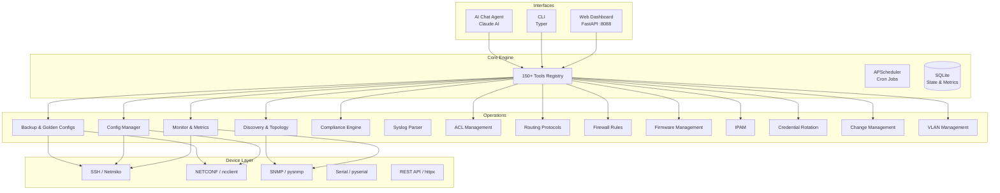

<p align="center">
  
</p>

<h1 align="center">network-agent</h1>

<p align="center">
  <strong>An AI-powered network engineering agent with 150+ tools for multi-vendor network automation, monitoring, and management.</strong>
</p>

<p align="center">
  
  
  
  
  
  
</p>

<p align="center">
  Built by <strong>David Lopez</strong> | <a href="https://github.com/bboydaves-afk">GitHub</a>
</p>

---

## Overview

**network-agent** is a comprehensive network operations platform that combines traditional network automation with conversational AI. It provides a unified interface — web dashboard, CLI, and AI chat — to manage multi-vendor infrastructure at scale.

Whether you're pushing config changes across 500 switches, running compliance audits against CIS benchmarks, or asking the AI agent to "show me all interfaces with CRC errors on the DC-WEST spine switches," network-agent handles it.

---

## Supported Vendors

| Vendor | Platform | Connection Methods |
|--------|----------|-------------------|
| **Cisco** | IOS, IOS-XE, NX-OS, ASA | SSH, NETCONF, SNMP, Serial |
| **Juniper** | Junos | SSH, NETCONF, SNMP |
| **Fortinet** | FortiOS | SSH, REST API, SNMP |
| **Palo Alto** | PAN-OS | SSH, XML API, SNMP |
| **MikroTik** | RouterOS | SSH, REST API, SNMP |
| **Aruba** | AOS-CX | SSH, REST API, NETCONF, SNMP |
| **Sophos** | XG/XGS | SSH, REST API, SNMP |
| **pfSense** | pfSense/OPNsense | SSH, XML-RPC, SNMP |

---

## Architecture



---

## Features

### Device Management
- **Multi-vendor abstraction** — Unified API across all supported vendors
- **Configuration management** — Push, pull, diff, and rollback with audit trails
- **Golden config enforcement** — Define desired state, auto-remediate drift
- **Serial console access** — Out-of-band management for unreachable devices

### Monitoring & Observability
- **SNMP polling** — Interface stats, CPU, memory, temperature, custom OIDs
- **Syslog ingestion** — Real-time parsing, classification, and alerting
- **Metric retention** — 30-day rolling storage
- **Network topology mapping** — Auto-discovered via CDP, LLDP, routing tables

### Security & Compliance
- **CIS benchmark auditing** — Automated checks against industry baselines
- **Custom compliance baselines** — Organization-specific policies
- **ACL management** — Centralized access control list lifecycle
- **Firewall rule management** — Unified CRUD across all vendors
- **Credential rotation** — Scheduled zero-downtime rollover

### Automation
- **Cron-based scheduling** — Discovery, compliance checks, config backups
- **Firmware management** — Image staging, compatibility checks, upgrades
- **VLAN management** — Centralized provisioning and consistency
- **IPAM** — IP tracking, subnet management, conflict detection
- **Change management** — Approval workflows and rollback plans

---

## Tech Stack

| Component | Technology |
|-----------|-----------|
| Runtime | Python 3.11+ |
| API Framework | FastAPI |
| SSH Automation | Netmiko |
| SNMP | pysnmp |
| NETCONF | ncclient |
| Serial | pyserial |
| HTTP Client | httpx |
| AI Engine | Claude AI (Anthropic) |
| Database | SQLite |
| Scheduler | APScheduler |
| CLI | Typer |

---

## Getting Started

```bash
git clone https://github.com/bboydaves-afk/network-agent.git
cd network-agent

python -m venv venv
source venv/bin/activate  # Linux/macOS
venv\Scripts\activate     # Windows

pip install -r requirements.txt

cp .env.example .env
# Edit .env with your API keys and device credentials
```

### Running

```bash
# Start full application (web + scheduler + agent)
python run.py web

# CLI operations
python run.py cli discovery run --subnet 10.0.0.0/16
python run.py cli backup run --all
python run.py cli compliance audit --benchmark cis
```

Web dashboard available at `http://localhost:8088`.

---

## Project Structure

```
network-agent/
├── run.py
├── config.yaml
├── requirements.txt
│
├── devices/                        # Device abstraction layer
│   ├── base.py
│   ├── serial_device.py
│   └── vendors/ (aruba, cisco_asa, cisco_nxos, sophos, serial)
│
├── operations/                     # Core operational modules
│   ├── monitor.py
│   ├── config_manager.py
│   ├── backup.py
│   ├── discovery.py
│   ├── compliance.py
│   ├── syslog.py
│   ├── acl.py
│   ├── routing.py
│   ├── firewall.py
│   ├── firmware.py
│   ├── ipam.py
│   ├── credential_rotation.py
│   ├── change_management.py
│   ├── topology.py
│   ├── traffic.py
│   ├── sites.py
│   └── vlan.py
│
├── alerts/ (engine, channels/slack, email, webhook)
│
├── interfaces/
│   ├── ai_agent/ (agent.py, tools/, handlers/)
│   ├── web/ (routes/)
│   └── cli/ (subcommands for all operations)
│
└── data/ (compliance/, golden_configs/, syslog/)
```

---

## License

MIT License.

---

<p align="center">
  Built by <a href="https://github.com/bboydaves-afk">David Lopez</a>
</p>
